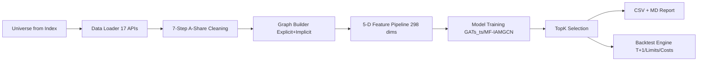

# GNN Deep Graph Neural Network · A-Share Quantitative Stock Selection

Use this skill when you need GNN-based quantitative stock selection for the A-share market. Supports multi-layer heterogeneous graphs (Shenwan L1/L2/L3 industries + concept sectors + institutional holdings + DTW similarity + Pearson correlation), dual GNN architectures (GATs_ts + MF-IAMGCN), five-dimensional feature engineering (price-volume / fundamental / sentiment / macro / relational), TopK stock selection, and a complete A-share backtest engine (T+1 settlement, price limit simulation, commission + stamp tax + slippage).

[](https://github.com/quantskills/skill-dl-gnn-stock-graph/actions/workflows/validate.yml)


[](LICENSE)

---

## Project Positioning

This skill implements a GNN-based quantitative stock selection system.

- **Point-in-time**: All features and labels strictly use `date < T` data; no future function.
- **Multi-layer heterogeneous graph**: Explicit edges (Shenwan L1/L2/L3 industries + concepts + institutional holdings) + implicit edges (DTW + Pearson correlation).
- **Dual model architecture**: GATs_ts (RNN + Dynamic Graph Attention) and MF-IAMGCN (Mixed-Frequency Inter-temporal Attention).
- **Reproducible**: Same `--seed` produces identical TopK order.
- **A-Share compliant**: T+1 settlement, price limits, real trading costs, ST/sub-new-stock filtering.

> Current verified range: CSI300. CSI500/CSI1000 APIs are adapted but not end-to-end tested.

## Workflow



## ⚠️ Disclaimer

- **Research & Educational Use Only**: This skill is a quantitative trading research tool and does NOT constitute investment advice, financial advice, or trading recommendations of any kind.
- **No Guaranteed Returns**: Backtest or simulation results do not represent actual trading performance. Past performance does not predict future results. Users assume all trading risks.
- **Risk Boundaries**: This tool does not account for market liquidity, price limits, trading halts, slippage, or auction sessions. Generated stock selection signals may be unfillable or result in losses. GNN model predictions carry inherent uncertainty and should not be the sole basis for trading decisions.
- **No Official Endorsement**: This is a QuantSkills community project. It has not been professionally audited or certified by any regulatory body.

## Three-State Results

| Status | Meaning |
|---|---|
| `selected` | `rank <= top_k`: stock passes all filters and is in TopK. |
| `filtered_out` | Stock passes filters but not in TopK (predicted score below threshold). |
| `excluded` | Stock excluded due to ST, sub-new listing, suspension, or insufficient liquidity. |

## Quick Start

```bash
# 1. Install dependencies
pip install -r requirements.txt

# 2. Set environment variables
export PANDA_DATA_USERNAME=<your_username>
export PANDA_DATA_PASSWORD=<your_password>

# 3. Field self-check (first use)
python3 -m scripts.data.loader --self-check --date 20260729

# 4. Run unit tests
python3 -m pytest tests/ -v

# 5. Single-day stock selection (~6-10s)
python3 scripts/scan.py --date 20260731 --model gats_ts --train_days 120 --epochs 10 --top_k 10
```

## Core Design

1. **Multi-layer Heterogeneous Graph**: Shenwan L1/L2/L3 three-tier industry edges + concept sectors + institutional co-holdings + DTW morphological similarity + Pearson return correlation. Finer industry granularity yields stronger co-movement signals.

2. **Dual Model Architecture**: GATs_ts (RNN + Dynamic Graph Attention Network, literature reports +28.9% annualized excess over CSI300) + MF-IAMGCN (Mixed-Frequency Inter-temporal Attention Multi-GCN, supports daily price + quarterly fundamental data via MIDAS alignment).

3. **Five-Dimensional Features**: Price-volume (14 dims, daily) + Fundamental (7 dims, quarterly→daily forward-filled) + Sentiment (3 dims, dragon-tiger board / block trades / external LLM) + Macro (4 dims, GDP/CPI/PMI/M2) + Relational (4 dims, centrality/Pagerank/DTW mean/industry excess return). Full Winsorize + Z-score pipeline with strict no-lookahead-bias.

4. **A-Share Cleaning Pipeline**: Post-rights verification → limit-up/down zero-value flagging → suspension forward-fill → ST/*ST filtering → sub-new-stock filtering (< 60 days listed) → trading calendar alignment → extreme-value Winsorization.

5. **Complete Backtest Engine**: T+1 settlement, price limit buy/sell restrictions, real trading costs (0.03% commission + 0.1% stamp tax on sells + 0.1% slippage), equal-weight allocation, daily rebalancing. Outputs Sharpe/Sortino/Calmar/Information Ratio/Max Drawdown/Annualized Turnover.

## Verified Snapshot

`2026-07-31`, model & schema `0.1.0`:

| Metric | Value |
|---|---:|
| Model | GATs_ts |
| Universe | CSI300 (300 stocks) |
| TopK | 30 |
| Training time | ~6-10s |
| Feature dimensions | 298 (20d × 14 price + 7 fundamental + 3 sentiment + 4 macro + 4 relational) |
| Tests passed | 52 |
| Reproducible | ✅ same seed → same TopK |

This snapshot verifies end-to-end execution and training reproducibility. It does not represent historical returns or investment advice.

## Directory Structure

```
├── SKILL.md                                ← Skill specification + qsh-form
├── README.md                               ← Chinese README
├── README.en.md                            ← This file
├── LICENSE                                 ← GPL-3.0
├── INSTALL.md                              ← Multi-platform install guide
├── requirements.txt                        ← Dependency declaration
├── requirements-dev.txt                    ← Dev/test dependencies
├── skill.json                              ← Skill metadata
├── config/
│   └── model_config.yaml                   ← Centralized model hyperparameters
├── scripts/
│   ├── scan.py                             ← Main CLI entry (single-day + backtest)
│   ├── validate.py                         ← CSV/MD output contract validator
│   ├── validate-qsh-form.mjs               ← qsh-form JSON validator
│   ├── report.py                           ← CSV + Markdown report emitter
│   ├── data/                               ← Data layer (panda_data wrappers + calendar + cleaner)
│   ├── graph/                              ← Graph layer (explicit/implicit edges + builder)
│   ├── features/                           ← Feature engineering (price/fundamental/sentiment/relation + pipeline)
│   ├── model/                              ← GNN models (GAT/GCN layers, GATs_ts, MF-IAMGCN, training loop)
│   ├── strategy/                           ← Strategy layer (TopK selector + RankNet)
│   ├── backtest/                           ← Backtest (engine + trading rules + metrics)
│   └── risk/                               ← Risk monitoring (market/liquidity/systemic/concentration)
├── tests/                                  ← 52 unit tests (all passing)
│   ├── conftest.py
│   ├── test_calendar.py
│   ├── test_cleaner.py
│   ├── test_graph.py
│   ├── test_features.py
│   ├── test_model.py
│   └── test_strategy_backtest.py
└── references/
    ├── data_guide.md                       ← Feature-to-API-to-formula mapping
    ├── methodology.md                      ← Methodology freeze (v0.1.0)
    ├── source_boundary.md                  ← Data source boundary
    └── need_used_api.md                    ← panda_data API reference
```

## Verification Status

- scan.py runs independently ✅
- 52 unit tests all passing ✅
- panda_data field self-check passed (8/8 interface columns aligned) ✅
- End-to-end stock selection verified (GATs_ts, CSI300, 300 stocks, 10 epochs, 6-10s) ✅
- Training reproducibility (same seed → same TopK) ✅
- Backtest T+1/price limits/costs simulated ✅
- No lookahead bias (training set strictly `date < T`) ✅

## Output & Audit

### CSV Output

- `trade_date`, `rank`, `symbol`, `name`, `score`, `ret_T`, `sector`, `market_cap`
- `rank` sequential 1..K with no gaps
- `score` monotonically non-increasing

### Markdown Report

- TopK table + sector distribution + model metadata
- Backtest mode adds performance metrics and trading statistics

### Validation

```bash
python scripts/validate.py output/gnn_picks_YYYYMMDD.csv
node scripts/validate-qsh-form.mjs SKILL.md
```

## Methodology & Boundaries

- [Feature & Data Field Guide](references/data_guide.md)
- [Methodology Freeze](references/methodology.md)
- [Source Boundary](references/source_boundary.md)
- [API Reference](references/need_used_api.md)
- [Changelog](CHANGELOG.md)

## Supported Runtimes

| Platform | Install Guide |
|---|---|
| Claude Code | `INSTALL.md` § Claude Code |
| Codex (OpenAI) | `INSTALL.md` § Codex |
| Cursor | `INSTALL.md` § Cursor |
| Hermes | `INSTALL.md` § Hermes |
| OpenClaw | `INSTALL.md` § OpenClaw |

## Limitations & Future Work

| Limitation | Detail | Plan |
|---|---|---|
| CSI300 only verified | CSI500/CSI1000 API adapted but not E2E tested | v0.2 |
| News sentiment requires external LLM | panda_data has no text API; sentiment defaults to NaN | Integrate LLM sentiment pipeline |
| No supply chain data source | Supply chain edges disabled by default | Integrate external database |
| Granger causality O(N²·T) | Computationally heavy, disabled by default | GPU batch testing |
| Daily rebalance only | No intraday execution | v0.2 sub-daily |
| Concept API has plan limits | Full concept pull may return error 600003 | Per-stock pull |
| MF-IAMGCN not fully tuned | E2E verified but no hyperparameter search or ablation | v0.2 |

## Dependencies

- Python 3.10+
- PyTorch 2.0+ (GNN inference + training)
- panda_data (financial market data, account required)
- pandas, numpy, scikit-learn, pyyaml
- pytest (testing)

## License

GPL-3.0 — See [LICENSE](LICENSE)
