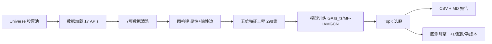

# README

# GNN 深度图神经网络 · A股量化选股

当需要对 A 股市场进行 GNN 量化选股时，使用此 skill。支持多层异构图（申万 L1/L2/L3 行业 + 概念板块 + 机构持仓 + DTW 形态相似 + Pearson 相关性）构建、GATs_ts 与 MF-IAMGCN 双模型架构、五维特征工程（量价/基本面/情绪/宏观/关系）、TopK 选股策略、完整 A 股回测引擎（含 T+1/涨跌停/佣金+印花税+滑点模拟）。

[](https://github.com/panda-trading/skill-dl-gnn-stock-graph/actions/workflows/validate.yml)


[](LICENSE)

---

## 项目定位

这个 Skill 实现的是基于图神经网络的量化选股系统，不是简单的因子打分器。

- **Point-in-time**：所有特征和标签严格使用 `date < T` 的数据，无未来函数。
- **多层异构图**：显性边（申万 L1/L2/L3 行业 + 概念 + 机构持仓）+ 隐性边（DTW + Pearson 相关性）。
- **双模型架构**：GATs_ts（RNN + 动态图注意力）和 MF-IAMGCN（混频跨期注意力）。
- **可复现**：相同 `--seed` 产生相同 TopK 排序。
- **A股合规**：T+1、涨跌停、真实交易成本、ST/次新股过滤。

> 当前验证范围是沪深300。中证500/1000 接口已适配但未做端到端测试。

## 工作流程



## ⚠️ 免责声明

- **仅供研究与教育用途**：本 skill 仅为量化交易研究工具，不构成任何形式的投资建议、理财建议或交易推荐。
- **不保证收益**：回测或模拟结果不代表实际交易表现。过去表现不代表未来结果。使用者应自行承担全部交易风险。
- **风险边界**：本工具不感知市场流动性、涨跌停、停牌、滑点、集合竞价等实际交易约束，生成的选股信号可能因市场条件变化而无法成交或造成亏损。GNN 模型预测存在固有不确定性，不应作为唯一决策依据。
- **非官方背书**：本项目为 QuantSkills 社区项目，未经专业审计或监管机构认证。

## 三态结果

| 状态 | 含义 |
|---|---|
| `selected` | `rank <= top_k`：股票通过所有过滤器且进入 TopK。 |
| `filtered_out` | 股票通过过滤器但未进入 TopK（预测得分低于阈值）。 |
| `excluded` | 股票因 ST、次新股、停牌、流动性不足被排除。 |

## 快速开始

```bash
# 1. 安装依赖
pip install -r requirements.txt

# 2. 设置环境变量
export PANDA_DATA_USERNAME=<your_username>
export PANDA_DATA_PASSWORD=<your_password>

# 3. 字段自检（首次使用）
python3 -m scripts.data.loader --self-check --date 20260729

# 4. 运行单元测试
python3 -m pytest tests/ -v

# 5. 端到端选股（约 6-10 秒）
python3 scripts/scan.py --date 20260731 --model gats_ts --train_days 120 --epochs 10 --top_k 10

# 6. 端到端快速验证
python3 scripts/_e2e_smoke.py --date 20260731 --epochs 5
```

## 核心设计要点

1. **多层异构图**：申万 L1/L2/L3 三级行业边 + 概念板块 + 机构共同持仓 + DTW 形态相似度 + Pearson 收益相关性。L3 边权重 > L2 > L1，更细粒度行业联动信号更强。

2. **双模型架构**：GATs_ts（RNN + 动态图注意力网络，文献报告相对沪深 300 年化超额 +28.9%）+ MF-IAMGCN（混频跨期注意力多层图卷积，支持日频量价 + 季频基本面 MIDAS 对齐）。

3. **五维特征工程**：量价 14 维（日频窗口展平）+ 基本面 7 维（PE/PB/ROE/增长/负债率）+ 情绪 3 维（龙虎榜/大宗/外部 LLM 情感）+ 宏观 4 维（GDP/CPI/PMI/M2）+ 关系 4 维（中心性/Pagerank/DTW 均值/行业超额收益）。全流程 Winsorize + Z-score 标准化，严格无未来函数。

4. **A 股数据清洗管线**：后复权验证 → 涨跌停零值标记 → 停牌前向填充 → ST/*ST 过滤 → 次新股过滤（上市 < 60 天）→ 交易日历对齐 → 极值 Winsorize。

5. **完整回测引擎**：T+1 制度，涨跌停买卖限制，真实交易成本（佣金 0.03% + 印花税 0.1% 卖出 + 滑点 0.1%），等权分配，每日调仓。输出夏普/索提诺/卡玛/信息比率/最大回撤/年化换手率。

## 已验证快照

`2026-07-31`、模型与 schema `0.1.0`：

| 指标 | 数量 |
|---|---:|
| 模型 | GATs_ts |
| 股票池 | CSI300（300 只） |
| TopK | 30 |
| 训练时间 | ~6-10s |
| 特征维度 | 298 维（20 日 × 14 量价 + 7 基本面 + 3 情绪 + 4 宏观 + 4 关系） |
| 测试通过 | 52 项 |
| 可复现 | ✅ 相同 seed → 相同 TopK |

该快照用于验证端到端执行和训练可复现性，不代表历史收益或投资建议。

## 目录结构

```
├── SKILL.md                                ← 技能设计书 + qsh-form
├── README.md                               ← 本文件
├── README.en.md                            ← English version
├── LICENSE                                 ← GPL-3.0
├── INSTALL.md                              ← 多平台安装指南
├── requirements.txt                        ← 依赖声明
├── requirements-dev.txt                    ← 开发/测试依赖
├── skill.json                              ← Skill 元数据
├── config/
│   └── model_config.yaml                   ← 模型超参集中管理
├── scripts/
│   ├── scan.py                             ← 主入口 CLI（单日选股 + 多日回测）
│   ├── validate.py                         ← CSV/MD 输出契约校验
│   ├── validate-qsh-form.mjs               ← qsh-form JSON 格式校验
│   ├── report.py                           ← CSV + Markdown 报告输出
│   ├── data/                               ← 数据层（panda_data 封装 + 日历 + 清洗）
│   ├── graph/                              ← 图层（显性/隐性边 + 构建器）
│   ├── features/                           ← 特征工程（量价/基本面/情绪/关系 + 管道）
│   ├── model/                              ← GNN 模型（GAT/GCN 层 + GATs_ts + MF-IAMGCN + 训练循环）
│   ├── strategy/                           ← 策略层（TopK 选股 + RankNet）
│   ├── backtest/                           ← 回测（引擎 + 交易规则 + 指标）
│   └── risk/                               ← 风控（市场/流动性/系统性/集中度）
├── tests/                                  ← 52 个单元测试
│   ├── conftest.py
│   ├── test_calendar.py
│   ├── test_cleaner.py
│   ├── test_graph.py
│   ├── test_features.py
│   ├── test_model.py
│   └── test_strategy_backtest.py
├── production/
│   └── SKILL.md                            ← 产出物读取契约
└── references/
    ├── data_guide.md                       ← 特征到 API 到公式的完整字段口径
    ├── methodology.md                      ← 方法冻结（v0.1.0）
    ├── source_boundary.md                  ← 数据源边界
    └── need_used_api.md                    ← panda_data 接口文档
```

## 验收状态

- scan.py 独立可运行 ✅
- 52 单元测试全通过 ✅
- panda_data 字段自检通过（8/8 接口字段对齐）✅
- 端到端选股跑通（GATs_ts, 沪深300, 300 只股票, 10 epochs, 6-10 秒）✅
- 训练可复现（相同 seed → 相同 TopK）✅
- 回测 T+1/涨跌停/成本模拟 ✅
- 无未来函数（训练集严格 `date < T`）✅

## 输出与审计

### 顶层 CSV

- `trade_date`、`rank`、`symbol`、`name`、`score`、`ret_T`、`sector`、`market_cap`
- `rank` 连续 1..K，无缺口
- `score` 单调非递增

### Markdown 报告

- TopK 排名表 + 行业分布 + 模型元信息
- 回测模式额外含绩效指标和交易统计

### 校验

```bash
python scripts/validate.py output/gnn_picks_YYYYMMDD.csv
node scripts/validate-qsh-form.mjs SKILL.md
```

## 方法与边界

- [特征与字段口径](references/data_guide.md)
- [方法冻结](references/methodology.md)
- [数据源边界](references/source_boundary.md)
- [API 接口文档](references/need_used_api.md)
- [产出物读取契约](production/SKILL.md)
- [版本记录](CHANGELOG.md)

## 支持的运行时平台

| 平台 | 安装指南 |
|---|---|
| Claude Code | `INSTALL.md` § Claude Code |
| Codex (OpenAI) | `INSTALL.md` § Codex |
| Cursor | `INSTALL.md` § Cursor |
| Hermes | `INSTALL.md` § Hermes |
| OpenClaw | `INSTALL.md` § OpenClaw |

## 局限与后续优化方向

| 局限 | 说明 | 后续 |
|---|---|---|
| 仅沪深 300 实跑验证 | 中证 500/1000 接口适配但未端到端测试 | v0.2 扩展 |
| 新闻情感需外部注入 | panda_data 无新闻文本接口，情绪因子默认不启用 | 集成 LLM 情感管线 |
| 供应链关系无数据源 | 显性供应链边默认关闭 | 接入外部数据库 |
| 格兰杰因果计算量大 | O(N²·T)，默认关闭 | 引入 GPU 批量检验 |
| 仅日频调仓 | 不支持日内 | v0.2 增加分钟级 |
| 概念板块接口有套餐限额 | 全量概念拉取部分套餐报 600003 | 按需按股票拉取 |
| MF-IAMGCN 仅端到端验证 | 未做完整超参搜索和消融实验 | v0.2 补充 |

## 依赖

- Python 3.10+
- PyTorch 2.0+（GNN 推理 + 训练）
- panda_data（金融市场数据，需账号）
- pandas, numpy, scikit-learn, pyyaml
- pytest（测试）

## License

GPL-3.0 — 详见 [LICENSE](LICENSE)
